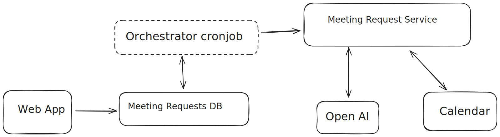

# CallFlow

An AI-driven meeting scheduler that autonomously places phone calls, negotiates appointment times through natural voice conversations, and books events directly into Google Calendar.

## System Overview

- **Frontend** (`fe`): A Next.js web application that enables users to create and manage meeting requests. It also integrates Google authentication, which is later used to interact with the user’s Google Calendar for booking meetings.
- **Meeting Service** (`meeting_request_api_service`): A FastAPI WebSocket-based backend responsible for placing voice calls via an AI agent. The agent actively communicates with clients over the phone to finalize and confirm meeting times.
- **Orchestrator** (`orchestrator_cronjob`): A scheduled job that runs every 5 minutes. It scans for pending meeting requests, checks for available phone numbers, and initiates AI-driven calls accordingly.
